```mermaid
graph TB
    A[Frontend - React] --> B[Backend - Node.js]
    B --> C[Database - MongoDB]
    B --> D[Authentication - Firebase]
    A --> E[Real-time - Socket.IO]
    B --> E
    A --> F[State Management - React Query]
    B --> F
    A --> G[UI Framework - Tailwind CSS]
    A --> H[Animations - Framer Motion]

    style A fill:#61DAFB
    style B fill:#339933
    style C fill:#47A248
    style D fill:#FFCA28
    style E fill:#010101
    style F fill:#FF4154
    style G fill:#38B2AC
    style H fill:#0055FF
```

# 🚀 Saifuddin Ahammed Monna - Portfolio with Live Chat

<div align="center">
  
</div>

<div align="center">
  
</div>

<div align="center">
  <br/>
  <a href="https://saifuddinahammed-monna.web.app/">
    
  </a>
  <a href="#">
    
  </a>
  <a href="#">
    
  </a>
</div>

---

<div align="center">
  <h3>🚀 Tech Stack</h3>


</div>

---

## 📋 Table of Contents

<details open>
<summary>📖 <b>Quick Navigation</b></summary>

- [✨ Features](#-features)
- [🌐 Live Demo](#-live-demo)
- [🏗 Architecture](#-architecture)
- [🚀 Getting Started](#-getting-started)
- [🛠 Tech Stack](#-tech-stack)
- [📱 Key Features Demo](#-key-features-demo)
- [🎯 Interview Highlights](#-interview-highlights)
- [📊 Performance Metrics](#-performance-metrics)
- [🔧 Customization](#-customization)
- [🚀 Deployment](#-deployment)
- [🤝 Contributing](#-contributing)
- [📞 Contact](#-contact)

</details>

---

## 📁 Project Structure

A modern, scalable folder structure separates frontend (React) and backend (Node.js/Express) for maintainability and growth.

```
portpolio-with-liveChat/
├── backend/      # Node.js/Express/MongoDB backend
├── public/       # Static assets
├── src/          # React frontend source code
├── ...           # Config, docs, etc.
```

See [PROJECT_STRUCTURE.md](./PROJECT_STRUCTURE.md) for a detailed breakdown.

---

## 🖥️ Backend / Frontend Split

```mermaid
graph TD;
  A[Frontend (React, src/)] --API, WebSocket--> B[Backend (Node.js/Express, backend/)]
  B --DB--> C[(MongoDB)]
  B --Auth--> D[(Firebase Auth)]
  A --Static Assets--> E[public/]
```

---

## 📚 Documentation & Guides
- [Project Structure](./PROJECT_STRUCTURE.md)
- [Server Group Implementation Guide](./SERVER_GROUP_IMPLEMENTATION_GUIDE.md)
- [Performance Optimization](./PERFORMANCE_OPTIMIZATION.md)
- [Frontend-Server Integration Guide](./FRONTEND_SERVER_INTEGRATION_GUIDE.md)

---

## 🚀 Quick Start

### 1. Backend
```bash
cd backend
npm install
npm start
```

### 2. Frontend
```bash
npm install
npm start
```

---

## ✨ Features

<div align="center">
  <h3>🎨 Modern UI/UX</h3>
</div>

| Feature                    | Description                                 | Status |
| -------------------------- | ------------------------------------------- | ------ |
| 🌙 **Dark/Light Theme**    | Complete theme switching with CSS variables | ✅     |
| 📱 **Responsive Design**   | Mobile-first approach with Tailwind CSS     | ✅     |
| ✨ **Smooth Animations**   | Framer Motion powered transitions           | ✅     |
| 🎯 **Professional Layout** | Clean, modern portfolio design              | ✅     |
| ♿ **Accessibility**       | WCAG 2.1 compliant design                   | ✅     |

<div align="center">
  <h3>💬 Real-Time Live Chat System</h3>
</div>

| Feature                    | Description                                | Status |
| -------------------------- | ------------------------------------------ | ------ |
| 📢 **Multi-Channel Chat**  | Public, Private, and Group messaging       | ✅     |
| ⚡ **Real-Time Features**  | Typing indicators, read receipts, presence | ✅     |
| 👥 **Group Management**    | Create groups, manage members, permissions | ✅     |
| 👤 **Guest Access**        | Anonymous users can participate            | ✅     |
| 💾 **Message Persistence** | Chat history stored in MongoDB             | ✅     |

<div align="center">
  <h3>📝 Blog System</h3>
</div>

| Feature                 | Description                                  | Status |
| ----------------------- | -------------------------------------------- | ------ |
| ✍️ **Rich Text Editor** | TinyMCE integration with custom toolbar      | ✅     |
| 🔄 **CRUD Operations**  | Full create, read, update, delete blog posts | ✅     |
| 🔍 **Search & Filter**  | Advanced search with categories and tags     | ✅     |
| ❤️ **Like System**      | User engagement with like functionality      | ✅     |
| ⚙️ **Admin Panel**      | Content management with moderation tools     | ✅     |

<div align="center">
  <h3>⭐ Testimonials Management</h3>
</div>

| Feature                  | Description                                     | Status |
| ------------------------ | ----------------------------------------------- | ------ |
| 📝 **User Submissions**  | Public testimonial submission with validation   | ✅     |
| 📊 **Admin Dashboard**   | Complete testimonial management with statistics | ✅     |
| ✅ **Status Management** | Approve/reject testimonials with workflow       | ✅     |
| ⭐ **Rating System**     | 5-star rating with visual display               | ✅     |
| 🛡️ **Moderation Tools**  | Spam detection and content filtering            | ✅     |
=======


**A modern, full-stack portfolio website featuring real-time live chat functionality, blog system, testimonials management, and comprehensive project showcase.**

[🌐 Live Demo](https://saifuddinahammed-monna.web.app/) • [📖 Documentation](#) • [🐛 Report Issues](#)

</div>

---

## 📋 Table of Contents

- [✨ Features](#-features)
- [🌐 Live Demo](#-live-demo)
- [🏗 Architecture](#-architecture)
- [🚀 Getting Started](#-getting-started)
- [🛠 Tech Stack](#-tech-stack)
- [📱 Key Features Demo](#-key-features-demo)
- [🎯 Interview Highlights](#-interview-highlights)
- [📊 Performance Metrics](#-performance-metrics)
- [🔧 Customization](#-customization)
- [🚀 Deployment](#-deployment)
- [🤝 Contributing](#-contributing)
- [📞 Contact](#-contact)

---

## ✨ Features

### 🎨 **Modern UI/UX**

- **🌙 Dark/Light Theme System** - Complete theme switching with CSS variables
- **📱 Responsive Design** - Mobile-first approach with Tailwind CSS
- **✨ Smooth Animations** - Framer Motion powered transitions
- **🎯 Professional Layout** - Clean, modern portfolio design
- **♿ Accessibility** - WCAG 2.1 compliant design

### 💬 **Real-Time Live Chat System**

- **📢 Multi-Channel Chat** - Public, Private, and Group messaging
- **⚡ Real-Time Features**:
  - Live typing indicators with debouncing
  - Message read receipts and delivery status
  - Online/offline status with presence indicators
  - Message editing & deletion with permissions
  - Emoji picker integration with search
  - File sharing capabilities
- **👥 Group Management**:
  - Create custom chat groups with descriptions
  - Add/remove group members with role management
  - Group-specific permissions and settings
  - Group chat history and search
- **👤 Guest Access** - Anonymous users can participate in public chat
- **💾 Message Persistence** - Chat history stored in MongoDB

### 📝 **Blog System**

- **✍️ Rich Text Editor** - TinyMCE integration with custom toolbar
- **🔄 CRUD Operations** - Full create, read, update, delete blog posts
- **🔍 Search & Filter** - Advanced search with categories and tags
- **❤️ Like System** - User engagement with like functionality
- **⚙️ Admin Panel** - Content management with moderation tools
- **📈 SEO Optimization** - Meta tags, structured data, and sitemap
- **💬 Comment System** - User comments with moderation

### ⭐ **Testimonials Management**

- **📝 User Submissions** - Public testimonial submission form with validation
- **📊 Admin Dashboard** - Complete testimonial management with statistics
- **✅ Status Management** - Approve/reject testimonials with workflow
- **⭐ Rating System** - 5-star rating with visual display and analytics
- **👤 Rich Display** - Client images, company info, project links
- **🛡️ Moderation Tools** - Spam detection and content filtering

### 🔐 **Authentication & Authorization**

- **🔥 Firebase Authentication** - Email/password, Google OAuth, phone verification
- **👮‍♂️ Role-Based Access Control** - Admin, user, and guest roles with permissions
- **🔒 Protected Routes** - Secure content access with route guards
- **⏰ Session Management** - Persistent login with 7-day tokens
- **🔑 Password Recovery** - Secure password reset functionality

### 📱 **Portfolio Features**

- **🖼️ Project Gallery** - Interactive project showcase with filtering
- **📄 Resume Viewer** - PDF resume display with download and print
- **📊 Skills Visualization** - Animated skill charts and progress bars
- **📧 Contact Form** - EmailJS integration with spam protection
- **🔗 Social Links** - Professional social media integration
- **⬇️ Download CV** - Multiple format support (PDF, DOCX)

### 🛠 **Technical Features**

- **⚡ State Management** - React Query for server state with caching
- **🛡️ Error Handling** - Comprehensive error boundaries and fallbacks
- **⏳ Loading States** - Skeleton loaders and spinners with progress
- **🔔 Toast Notifications** - User feedback system with different types
- **📈 SEO Optimization** - Meta tags, structured data, and performance
- **📱 PWA Support** - Progressive Web App capabilities
- **🔌 Offline Support** - Service worker for offline functionality
>>>>>>> testimonialPage

---

## 🌐 Live Demo

<div align="center">
  <h3>🎨 Frontend Technologies</h3>
</div>

| Feature                  | Demo Link                                                                          | Status         |
| ------------------------ | ---------------------------------------------------------------------------------- | -------------- |
| 🌐 **Portfolio Website** | [https://saifuddinahammed-monna.web.app/](https://saifuddinahammed-monna.web.app/) | ✅ Live        |
| 💬 **Live Chat Demo**    | [Chat Demo](#)                                                                     | 🚧 Coming Soon |
| ⚙️ **Admin Panel**       | [Admin Demo](#)                                                                    | 🔒 Private     |

</div>

---

## 🏗 Architecture



```
📁 src/
├── 🔐 auth/                 # Authentication system
│   ├── 📱 components/       # Sign in/up forms with validation
│   ├── 🎯 context/         # Auth context provider with state
│   ├── 🪝 hooks/           # Custom authentication hooks
│   ├── 🔧 services/        # Firebase auth services
│   └── 🛠 utils/           # Auth utility functions
├── 💬 socketIo/            # Real-time chat system
│   ├── 🧩 components/      # Chat UI components
│   │   ├── ChatWindowComponents/  # Modular chat components
│   │   └── PrivateChatHistory.js  # Private chat management
│   ├── 🎯 contexts/        # Socket context and providers
│   └── 🔌 SocketProvider.js # Socket connection management
├── 🧩 components/          # Reusable UI components
│   ├── 👤 About/          # About page with skills and experience
│   ├── 📝 Blog/           # Blog system with editor and viewer
│   ├── ⭐ Testimonials/   # Testimonials with admin dashboard
│   ├── 🖼️ Gallery/        # Project gallery with lightbox
│   ├── 📄 resumes/        # Resume viewer with PDF support
│   ├── 🔧 CommonComponents/ # Shared components
│   └── 📐 MainLayouts/    # Layout components
├── 📄 pages/              # Page components and routing
├── 🔧 services/           # API services and data fetching
├── 🎨 theme/              # Theme configuration and variables
├── 🛠 utils/              # Utility functions and helpers
├── 🪝 hooks/              # Custom React hooks
└── 🎯 contexts/           # Global context providers
```

---

## 🚀 Getting Started

<div align="center">
  <h3>⚡ Quick Start Guide</h3>
</div>

<details>
<summary><b>📋 Prerequisites</b></summary>

- **Node.js** (v18 or higher) 🟢
- **npm** or **yarn** package manager 📦
- **Firebase** account and project 🔥
- **MongoDB** database (Atlas or local) 🍃
- **Git** for version control 📝

</details>

### ⚡ Quick Start

<details>
<summary><b>🚀 Installation Steps</b></summary>

1. **Clone the repository**

   ```bash
   git clone https://github.com/yourusername/portfolio-with-livechat.git
   cd portfolio-with-livechat
   ```

2. **Install dependencies**

   ```bash
   npm install
   # or
   yarn install
   ```

3. **Environment Setup**
   Create a `.env` file in the root directory:

   ```env
   # Firebase Configuration
   REACT_APP_FIREBASE_API_KEY=your_firebase_api_key
   REACT_APP_FIREBASE_AUTH_DOMAIN=your_project.firebaseapp.com
   REACT_APP_FIREBASE_PROJECT_ID=your_project_id
   REACT_APP_FIREBASE_STORAGE_BUCKET=your_project.appspot.com
   REACT_APP_FIREBASE_MESSAGING_SENDER_ID=your_sender_id
   REACT_APP_FIREBASE_APP_ID=your_app_id

   # Backend API Configuration
   REACT_APP_API_URL=http://localhost:5000 || API_URL
   REACT_APP_SOCKET_URL=http://localhost:5000 ||REACT_APP_API_API_URL

   # EmailJS Configuration (for contact form)
   REACT_APP_EMAILJS_SERVICE_ID=your_service_id
   REACT_APP_EMAILJS_TEMPLATE_ID=your_template_id
   REACT_APP_EMAILJS_PUBLIC_KEY=your_public_key

   # MongoDB Configuration
   REACT_APP_MONGODB_URI=your_mongodb_connection_string

   # Optional: Analytics
   REACT_APP_GA_TRACKING_ID=your_google_analytics_id
   ```

4. **Start the development server**

   ```bash
   npm start
   # or
   yarn start
   ```

5. **Open your browser**
   Navigate to [http://localhost:3000](http://localhost:3000)

</details>

---

## 🛠 Tech Stack

### Frontend

- **React 18.2.0** - Modern React with hooks and concurrent features
- **React Router 6.4.5** - Client-side routing with nested routes
- **Tailwind CSS 3.4.17** - Utility-first CSS framework
- **Framer Motion 9.1.7** - Animation library for React
- **React Query 5.81.5** - Server state management and caching
- **Socket.IO Client 4.8.1** - Real-time communication

### Backend & Database

- **Node.js 18+** - JavaScript runtime
- **Express.js** - Web application framework
- **Socket.IO 4.8.1** - Real-time bidirectional communication
- **MongoDB 5.0+** - NoSQL database
- **Mongoose** - MongoDB object modeling

### Authentication & Hosting

- **Firebase 9.23.0** - Authentication and hosting
- **Firebase Auth** - User authentication system
- **Firebase Hosting** - Static site hosting

### Development Tools

- **ESLint 8.57.1** - Code linting
- **Prettier** - Code formatting
- **PostCSS 8.5.5** - CSS processing
- **Autoprefixer 10.4.21** - CSS vendor prefixing

### Additional Libraries

- **React Icons 5.5.0** - Icon library
- **React Hot Toast 2.5.2** - Toast notifications
- **React PDF 9.2.1** - PDF viewing
- **React Photo View 1.2.3** - Image lightbox
- **TinyMCE React 6.2.1** - Rich text editor
- **EmailJS Browser 3.12.1** - Email service integration

---

## 📱 Key Features Demo

### 💬 Live Chat System

- **Real-time messaging** with Socket.IO
- **Multi-channel support** (Public, Private, Group)
- **Typing indicators** and read receipts
- **File sharing** and emoji support
- **User presence** and online status

### 📝 Blog Management

- **Rich text editor** with TinyMCE
- **CRUD operations** for blog posts
- **Search and filtering** capabilities
- **Admin dashboard** for content management
- **SEO optimization** with meta tags

### ⭐ Testimonials System

- **User submission form** with validation
- **Admin approval workflow** with status management
- **Rating system** with 5-star display
- **Rich display** with client images and company info
- **Moderation tools** for spam detection

### 🔐 Authentication System

- **Firebase Authentication** with multiple providers
- **Role-based access control** (Admin, User, Guest)
- **Protected routes** with route guards
- **Session management** with persistent login
- **Password recovery** functionality

### 📱 **Portfolio Features**

- **🖼️ Project Gallery** - Interactive project showcase with filtering
- **📄 Resume Viewer** - PDF resume display with download and print
- **📊 Skills Visualization** - Animated skill charts and progress bars
- **📧 Contact Form** - EmailJS integration with spam protection
- **🔗 Social Links** - Professional social media integration
- **⬇️ Download CV** - Multiple format support (PDF, DOCX)

### 🛠 **Technical Features**

- **⚡ State Management** - React Query for server state with caching
- **🛡️ Error Handling** - Comprehensive error boundaries and fallbacks
- **⏳ Loading States** - Skeleton loaders and spinners with progress
- **🔔 Toast Notifications** - User feedback system with different types
- **📈 SEO Optimization** - Meta tags, structured data, and performance
- **📱 PWA Support** - Progressive Web App capabilities
- **🔌 Offline Support** - Service worker for offline functionality
>>>>>>> testimonialPage

---

## 🎯 Interview Highlights

### Technical Achievements

- **Full-stack development** with modern JavaScript ecosystem
- **Real-time features** implementation with Socket.IO
- **State management** with React Query and Context API
- **Responsive design** with Tailwind CSS
- **Performance optimization** with lazy loading and code splitting

### Problem-Solving Skills

- **Complex UI interactions** with smooth animations
- **Real-time data synchronization** across multiple clients
- **Error handling** and user feedback systems
- **Security implementation** with authentication and authorization
- **Scalable architecture** design patterns

### Soft Skills Demonstrated

- **Project management** and feature planning
- **User experience** design and optimization
- **Documentation** and code organization
- **Testing** and quality assurance
- **Deployment** and DevOps practices

---

## 📊 Performance Metrics

### Frontend Performance

- **Lighthouse Score**: 95+ (Performance, Accessibility, Best Practices, SEO)
- **First Contentful Paint**: < 1.5s
- **Largest Contentful Paint**: < 2.5s
- **Cumulative Layout Shift**: < 0.1
- **First Input Delay**: < 100ms

### Backend Performance

- **API Response Time**: < 200ms average
- **Socket.IO Latency**: < 50ms
- **Database Query Time**: < 100ms
- **Memory Usage**: Optimized with proper cleanup
- **Error Rate**: < 0.1%

### Optimization Techniques

- **Code Splitting** with React.lazy()
- **Image Optimization** with WebP format
- **Bundle Size** optimization with tree shaking
- **Caching Strategy** with React Query
- **Service Worker** for offline support

---

## 🔧 Customization

### Theme Customization

```css
/* Custom CSS Variables */
:root {
  --primary-main: #3b82f6;
  --primary-dark: #1d4ed8;
  --background-default: #ffffff;
  --background-paper: #f8fafc;
  --text-primary: #1e293b;
  --text-secondary: #64748b;
}
```

### Component Customization

- **Modular component structure** for easy customization
- **Theme provider** for consistent styling
- **CSS-in-JS** support with styled-components
- **Tailwind configuration** for design system
- **Icon system** with React Icons

### Content Management

- **JSON configuration** for static content
- **CMS integration** ready
- **Dynamic content** loading
- **Localization** support structure
- **SEO optimization** tools

---

## 🚀 Deployment

### Firebase Hosting

```bash
# Build the project
npm run build

# Deploy to Firebase
firebase deploy
```

### Environment Variables

- **Production environment** configuration
- **API endpoints** for production
- **Analytics** and monitoring setup
- **Error tracking** with Sentry
- **Performance monitoring** with Lighthouse

### CI/CD Pipeline

- **GitHub Actions** for automated deployment
- **Testing** and quality checks
- **Build optimization** and caching
- **Security scanning** and vulnerability checks
- **Performance monitoring** and alerts

---

## 🤝 Contributing

We welcome contributions! Please see our [Contributing Guidelines](CONTRIBUTING.md) for details.

### Development Setup

1. Fork the repository
2. Create a feature branch
3. Make your changes
4. Add tests if applicable
5. Submit a pull request

### Code Standards

- **ESLint** configuration for code quality
- **Prettier** for consistent formatting
- **TypeScript** support (optional)
- **Testing** with Jest and React Testing Library
- **Documentation** with JSDoc comments

---

## 📞 Contact

- **Portfolio**: [https://saifuddinahammed-monna.web.app/](https://saifuddinahammed-monna.web.app/)
- **Email**: [your-email@example.com](mailto:your-email@example.com)
- **LinkedIn**: [Your LinkedIn Profile](#)
- **GitHub**: [Your GitHub Profile](#)

---

<div align="center">
Made with ❤️ by Saifuddin Ahammed Monna

[](https://github.com/yourusername/portfolio-with-livechat)
[](https://github.com/yourusername/portfolio-with-livechat)
[](https://github.com/yourusername/portfolio-with-livechat/issues)

</div>
